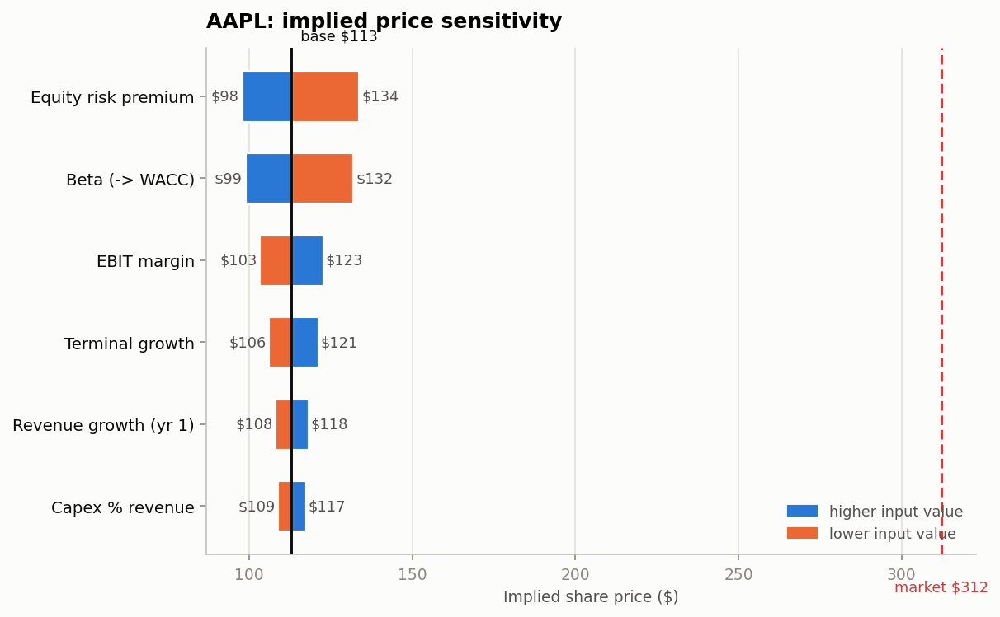
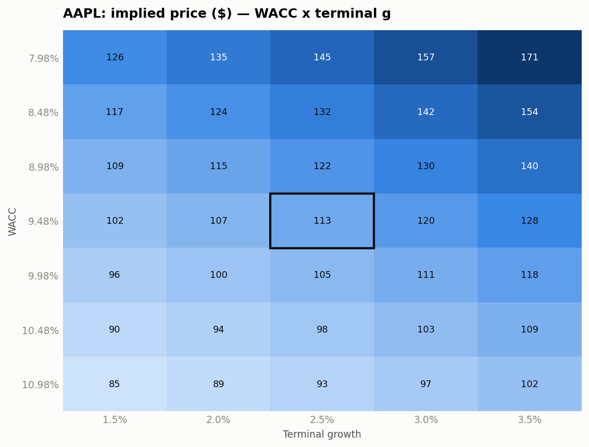

# Dynamic DCF Valuation Model
[](https://dynamicdcf-jxj9n6sxdxsqmvzzfk5ash.streamlit.app/)
**At its own historical fundamentals, Apple is worth about $113–135 a share. It trades at $312.**

That gap — roughly **62–64% below** the market price — is not a modelling error, and finding it is the point of this project. Run the model and it will tell you exactly what the market is assuming that history does not support:

- Apple trades at **31.7x EV/EBITDA** while ~5% revenue growth and a 31% operating margin support something closer to **11x**.
- To justify $312 on a 10-year forecast, you need **~29% annual revenue growth** off a $416B base. Apple's actual 5-year revenue CAGR is **5.2%**.
- The entire WACC × terminal-growth sensitivity grid — 35 combinations, including the most generous corner (8.0% WACC, 3.5% perpetual growth) — tops out at **$171**. There is no reasonable discount-rate assumption that reaches today's price.

The honest conclusion is not "Apple is a short." It is that **a conventional DCF cannot explain Apple's valuation**, and the model makes the size and shape of that gap explicit rather than burying it. That is a more useful result than a number engineered to agree with the market.

The same engine, pointed at other sectors, refuses to pretend:

| Ticker | Sector | Implied (Gordon) | Market | What the model says |
|---|---|---|---|---|
| **AAPL** | Technology | $112.98 | $312.18 | Credible output. Market prices in growth history doesn't support. |
| **JPM** | Bank | $464.08 | $356.77 | **Not a valid result.** FCFF doesn't fit a bank — flagged, not hidden. |
| **O** | REIT | $111.25 | $62.61 | **Not a valid result.** Use FFO/AFFO or NAV — flagged. |
| **RIVN** | Pre-profit EV | **$0.00** | $15.98 | Lossmaking: no equity value at these assumptions. Floored at zero. |

Refusing to emit a confident number for JPM, O and RIVN is a deliberate feature. A model that returns a clean-looking price for a bank is lying to you.

---

## What this is

A ticker-driven discounted cash flow model that pulls real financials from SEC EDGAR and values any US-listed company three ways — command line, a live Excel workbook, and an interactive web app — off **one shared engine**, so all three always agree.

The design principle throughout: **an assumption you cannot see is an assumption you cannot challenge.** Every driver is a named variable with a recorded source, and anything the filings could not supply is flagged in red as a fabricated default rather than quietly blended in with real data.

---

## Quick start

### Windows (PowerShell)

```powershell
.\setup.ps1
```

Then pick a surface:

```powershell
.\run.ps1 app              # interactive web app
.\run.ps1 value AAPL       # full DCF + sensitivity + tornado
.\run.ps1 excel AAPL       # live Excel workbook
.\run.ps1 data AAPL JPM O  # standardized SEC financials
```

`run.ps1` calls the virtual environment's interpreter directly, so you never
need to activate anything.

> **Why the scripts?** On Windows, `python` is usually *not* a working command
> even with Python installed — an "app execution alias" intercepts it and opens
> the Microsoft Store instead. The real command is `py`. `setup.ps1` detects
> this and uses whichever interpreter actually works. If you'd rather run things
> by hand, call the venv interpreter directly:
> `.venv\Scripts\python.exe valuation.py AAPL`

If PowerShell blocks the scripts (`running scripts is disabled on this system`),
allow local scripts for your user once:

```powershell
Set-ExecutionPolicy -Scope CurrentUser RemoteSigned
```

### macOS / Linux

```bash
python3 -m venv .venv && source .venv/bin/activate
pip install -r requirements.txt
```

```bash
python sec_pull.py AAPL JPM O          # standardized financials
python valuation.py AAPL               # full DCF + sensitivity + tornado
python build_excel.py AAPL             # live Excel workbook
streamlit run app.py                   # interactive web app
```

### SEC contact string (required)

The SEC requires automated callers to identify themselves and returns **HTTP 403**
to anyone using a placeholder address. Set this before your first run or nothing
will fetch:

```powershell
$env:SEC_UA_EMAIL = "you@example.com"     # PowerShell (current session)
```

```bash
export SEC_UA_EMAIL="you@example.com"     # bash / zsh
```

To avoid setting it every session, persist it once:

```powershell
[Environment]::SetEnvironmentVariable("SEC_UA_EMAIL", "you@example.com", "User")
```

No contact address is hard-coded in this repository — deliberately, so a personal
address is never committed to public source. On Streamlit Community Cloud, set it
under **Settings → Secrets** instead.

---

## The four components

### 1. Data pipeline — `sec_pull.py`

Maps the messy per-company XBRL tag universe onto canonical line items a DCF can consume.

The hard part is that filers tag the same concept differently, and **the correct tag changes by sector and over time**. Three mechanisms handle this:

- **Priority tag lists with merge-fill.** Revenue may be `RevenueFromContractWithCustomerExcludingAssessedTax` today and `SalesRevenueNet` before ASC 606. Rather than taking the first tag that matches, the pipeline merges across candidates by year — higher-priority tags win, lower ones backfill the years they don't cover. This recovered Apple's FY2016 revenue, which a first-match-wins approach silently drops.
- **Sector-aware debt aggregation.** REITs often never report the `LongTermDebt*` aggregates, listing notes/loans/secured debt as separate instruments instead. Naively summing tags gave Realty Income **$67M** of debt against an actual **~$26.8B**. The pipeline layers four strategies and only trusts the instrument-sum when the primary notes component is present, so it never reports a misleading partial.
- **"Not applicable" ≠ "missing".** A bank has no COGS, inventory or capex; a REIT has no COGS. These are marked `n/a for this sector` rather than `[NOT FOUND]`, so real data gaps stay visible instead of drowning in expected ones.

Where a figure genuinely isn't in the API — Realty Income's FY2017 notes payable were tagged only inside dimensional members — the pipeline reports a gap rather than inventing a smooth series.

### 2. Valuation engine — `valuation.py`

Unlevered FCFF DCF. Every assumption is a named field on an `Assumptions` dataclass, seeded from the company's own history and tagged with its provenance.

```
FCFF_t = EBIT_t × (1 − tax) + D&A_t − Capex_t − ΔNWC_t
WACC   = (E/V) × [r_f + β × ERP] + (D/V) × [k_d × (1 − tax)]
EV     = Σ FCFF_t / (1 + WACC)^t + PV(terminal value)
```

- **WACC** — CAPM cost of equity plus after-tax cost of debt, weighted by market cap and total debt.
- **Forecast** — revenue growth fades linearly from a history-derived rate to terminal; operating margin ramps from the latest actual to steady state.
- **Terminal value** — computed **both** ways, Gordon growth and exit EV/EBITDA, carried through to two implied prices. Each cross-checks the other: the Gordon TV reports its implied exit multiple, and the exit multiple reports its implied perpetuity growth. When those disagree violently, your assumptions are inconsistent.
- **Sensitivity** — a WACC × terminal-growth grid using standard data-table semantics (the explicit forecast is held fixed; only discounting and terminal value vary), plus a tornado ranking the assumptions by how far they move the result.

For Apple the tornado is unambiguous: **equity risk premium (±$36) and beta (±$33) dominate** — cost of capital, not operating performance, drives the answer. Worth knowing before arguing about margins.



The red dashed line is the market price. No single assumption moves the valuation anywhere near it.



### 3. Excel workbook — `build_excel.py`

Every calculation is a **real Excel formula**, never a Python-computed constant, so the model genuinely recalculates when a reader edits an assumption:

```excel
=Rev0*(1+g_init)                        ' revenue
=WgtEquity*CostEquity+WgtDebt*AfterTaxKd ' WACC
=C14*(1+g_term)/(WACC-g_term)            ' terminal value
```

Assumptions are Excel **defined names**, so formulas read like the algebra rather than `=$B$7*(1+$B$12)`. Standard conventions: blue hard-coded inputs, black formulas, yellow fills on editable assumptions, red on anything not derivable from the filings, Arial, negatives in parentheses, and a citation beside every input.

**Verification is part of the build.** `recalc_check.py` recalculates via LibreOffice headless (or the pure-Python `formulas` engine) and fails on any `#REF!`/`#DIV/0!`/`#VALUE!`. `verify_model.py` goes further and asserts the recalculated workbook **matches the Python engine**:

```
output                         Excel          Python        diff   status
WACC                          9.476%          9.476%    0.0000pp   OK
EV (Gordon)                1,692,703       1,692,703         0.0   OK
Price (Gordon)               $112.98         $112.98      $0.000   OK
```

Zero formula errors and exact agreement on AAPL, JPM and O.

**On the input/output boundary:** the workbook is *generated* per ticker, not driven by a live in-Excel query — and that is the right call. A `WEBSERVICE()`/Power Query approach against SEC XBRL is brittle, breaks on the SEC's User-Agent requirements, and makes the model unauditable because the numbers shift underneath you. A frozen, cited snapshot is reproducible and is what real transaction models do. The tradeoff is that the market snapshot goes stale, which is what the web app is for.

### 4. Interactive app — `app.py`

Streamlit front end on the same engine: enter a ticker, get the WACC build, forecast, valuation bridge, sensitivity grid and tornado chart live, with every assumption editable in the sidebar and an Excel export button.

---

## Handling what breaks

Most valuation tools quietly produce a number for any input. This one is built to notice when the number would be meaningless.

- **Fabricated inputs are marked.** Banks and REITs don't report `OperatingIncome`, so EBIT margin can't be derived. Rather than silently defaulting to a generic 30% presented like real data, those inputs are flagged red in Excel, ⚠ in the app, and listed in a `FABRICATED INPUTS` warning. This was the single most dangerous failure mode found during development.
- **Method-fit warnings.** A bank DCF warns that deposits are operating funding rather than debt (JPM's −$343B "net cash" badly inflates equity value) and points to dividend-discount / residual-income. A REIT warns that real-estate depreciation makes GAAP FCFF understate cash generation and points to FFO/AFFO or NAV.
- **Pre-profit companies.** Extrapolating Rivian's −66% margin forever produced an implied **−$53.80**. Now the margin ramps toward an explicitly-flagged placeholder, the displayed price floors at $0 (equity is limited-liability), the raw arithmetic stays visible, and three warnings explain that a lossmaking DCF is a scenario, not a measurement.
- **Structural checks.** Warnings fire when terminal value exceeds 85% of EV, when WACC ≤ terminal growth, when terminal-year FCFF is negative, and when net cash exceeds 25% of market cap.

---

## Methodology notes and limitations

- **FCFF, not FCFE** — values the whole firm, then bridges to equity via net debt. Consistent with a WACC discount rate.
- **Effective, not statutory, tax** — the 5-year average of tax expense over pre-tax income (16.8% for Apple, versus 21% statutory).
- **Beta is a market snapshot**, not re-levered to a target capital structure. For a materially different structure, re-lever it yourself.
- **End-of-year discounting**, not mid-year convention. Mid-year would raise values ~4–5%.
- **Not suitable as-is for** banks, insurers and REITs (flagged in-product), or for companies whose value is dominated by optionality, resource reserves, or an imminent binary event.
- Terminal value is **52–72%** of enterprise value depending on horizon. That's normal for a DCF and it is why both terminal methods and the full sensitivity grid are shown rather than a single point estimate.

**This is an educational model, not investment advice.**

---

## Project layout

```
sec_pull.py       SEC EDGAR XBRL pipeline -> standardized financials
market_data.py    Live price / market cap / beta (yfinance, fails soft)
valuation.py      DCF engine: WACC, forecast, terminal value, sensitivity, tornado
charts.py         Tornado + sensitivity figures (CVD-safe palette)
build_excel.py    Live-formula Excel workbook generator
recalc_check.py   Recalculates a workbook; fails on any formula error
verify_model.py   Asserts Excel output == Python engine output
app.py            Streamlit interactive app
test_app.py       Headless app tests across four awkward tickers
examples/         Committed sample output (AAPL workbook + charts)
```

Generated `models/`, `output/` and `data/` directories are gitignored — regenerate
them with the commands above. `examples/` is committed so the output is visible
without running anything.

## Requirements

Python 3.9+. LibreOffice is optional — used for authoritative workbook recalculation; without it, verification falls back to the pure-Python `formulas` engine.
